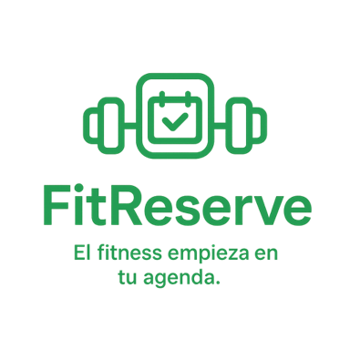

# FitReserve

## Integrantes

- **Víctor Pinilla Corraliza** - 45876874Q  
  

- **Carlos Castañón Cintado** - 45973798H  
  

## Eslogan

> "El fitness empieza en tu agenda."

## Resumen

FitReserve debe permitir al usuario reservar una sala del gimnasio para dar una clase o actividad, añadir la maquinaria necesaria y seleccionar un especialista para que controle los ejercicios.

## Descripción

FitReserve es una plataforma web diseñada para la gestión integral de actividades en un gimnasio. Su objetivo es simplificar la organización de clases, entrenamientos y uso de equipamiento, permitiendo a clientes y entrenadores interactuar de manera eficiente. El cliente seleccionará la sala, la actividad, la maquinaria necesaria y al entrenador que esté disponible para esa actividad en el horario de reserva. De esta forma, el entrenador sabrá las sesiones que tiene de forma ordenada y el cliente disfrutará de una sesión fitness personalizada y atendida.

## Funcionalidades y Requisitos

### Login
- El usuario, el entrenador y el administrador deben poder iniciar sesión con su correo electrónico y contraseña. 

### Gestión de usuarios y administración
- Un administrador debe poder de registrar, modificar o eliminar a los entrenadores.
- Los clientes deberán poder crear su cuenta, eliminarlas, cerrar sesión y modificar sus datos.
- El administrador debe poder gestionar usuarios, salas, actividades y equipamiento.
- El entrenador solo debe de poder modificar sus datos personales.

### Reservas
- El cliente debe poder seleccionar la sala del gimnasio donde quiere realizar la actividad.
- El cliente debe poder seleccionar la actividad que desea realizar.
- El cliente debe poder añadir la maquinaria o equipamiento necesario para la sesión.
- El cliente debe poder seleccionar un entrenador disponible para el horario y actividad elegidos.
- El sistema debe mostrar al usuario la disponibilidad de salas, entrenadores y maquinaria.
- El cliente debe poder cancelar o modificar la reserva antes de la hora de inicio.
- El entrenador debe poder cancelar una clase.
- Solo el entrenador puede poner una clase como completada.

### Visualización
- El entrenador debe poder ver las clases que tiene que impartir.
- El cliente debe ver la clase que tiene reservada, cuándo la tiene reservada y quién es el entrenador.
- El sistema debe permitir ver el historial de reservas del cliente y el de clases del entrenador.

## Funcionalidades opcionales, recomendables o futuribles

- El sistema debe generar notificaciones al cliente y al entrenador sobre la reserva (confirmación, cambios o cancelaciones).
- Envío de recordatorios automáticos por correo o notificación móvil antes de la reserva.
- Añadir un modo claro u oscuro.
- Que las clases que tiene que impartir el entrenador y las que tienen reservadas los clientes se muestren en un calendario.

## Base de Datos

El modelo representa la estructura de una base de datos para la gestión de reservas en un gimnasio.  
Incluye usuarios, entrenadores, clientes, reservas, actividades, salas y maquinaria.  
Su objetivo es mantener la trazabilidad de las reservas y los recursos asociados, permitiendo distinguir entre distintos 
tipos de usuarios y manejar la asignación de equipos y espacios.

### Entidades principales

#### **Usuario**
Contiene la información general de todas las personas registradas en el sistema.  
A partir de esta tabla se derivan dos subtipos: **Entrenador** y **Cliente**.

#### **Entrenador**
Subtipo de usuario.  
Incluye datos adicionales como especialidad, experiencia y horarios de trabajo.  
Cada entrenador es también un usuario, pero no todos los usuarios son entrenadores.

#### **Cliente**
Otro subtipo de usuario.  
Contiene información específica como fecha de nacimiento, género y objetivos personales.  
Cada cliente es un usuario, pero no todos los usuarios son clientes.

#### **Actividad**
Define las distintas actividades que pueden realizarse en el gimnasio (por ejemplo, yoga, spinning, entrenamiento funcional).  
Cada actividad tiene un nivel y tipo asociados.

#### **Sala**
Representa los espacios físicos donde se realizan las actividades.  
Incluye capacidad, ubicación y descripción.

#### **Maquinaria**
Define los equipos disponibles en el gimnasio (por ejemplo, bicicletas, pesas, cintas).  
Indica la cantidad total disponible y el tipo de maquinaria.

#### **Reserva**
Registra cada reserva realizada por un cliente.  
Está vinculada a un entrenador, una sala y una actividad, e incluye fechas, estado y comentarios.  
Permite saber cuándo y con qué recursos se realizará cada sesión.

#### **Reserva_Maquinaria**
Tabla intermedia que vincula las reservas con la maquinaria utilizada.  
Permite indicar cuántas unidades de cada tipo de máquina se emplean en una reserva específica.

### Relaciones y Justificación

#### **Usuario ↔ Entrenador / Cliente**
- Relación **1:1 opcional**.
- Representa herencia: un usuario puede ser entrenador o cliente (o ninguno, porque está el admin).
- Si se elimina un usuario, se eliminan sus datos asociados.

#### **Reserva ↔ Cliente / Sala / Actividad / Entrenador**
- Relación **N:1**.
- Una reserva pertenece a un solo cliente, sala, actividad y entrenador, pero cada uno de ellos puede tener muchas reservas.
- Las reservas mantienen el historial de actividades, pero en caso de se elimine algo asociado a una reserva, la reserva se debe
eliminar, para que no quede la reserva incompleta.

#### **Reserva ↔ Maquinaria**
- Relación **N:M**.
- Se gestiona mediante la tabla **Reserva_Maquinaria**.
- Permite registrar la cantidad de maquinaria utilizada por reserva.

